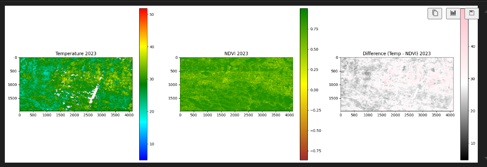
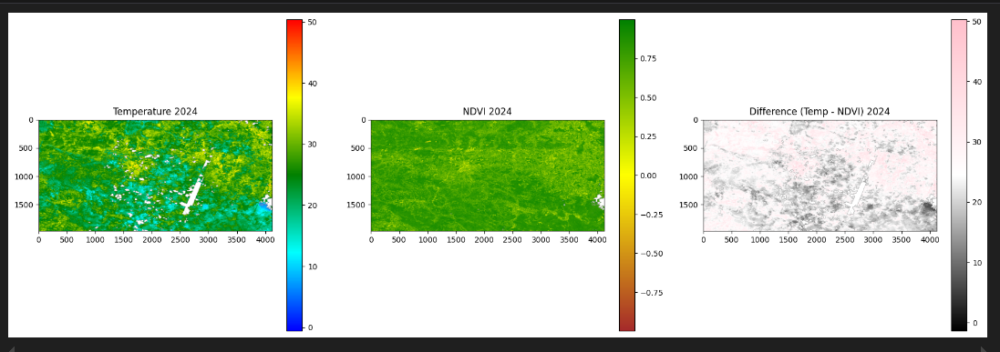
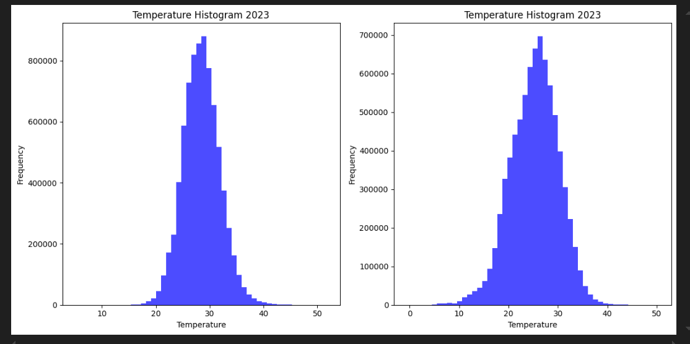
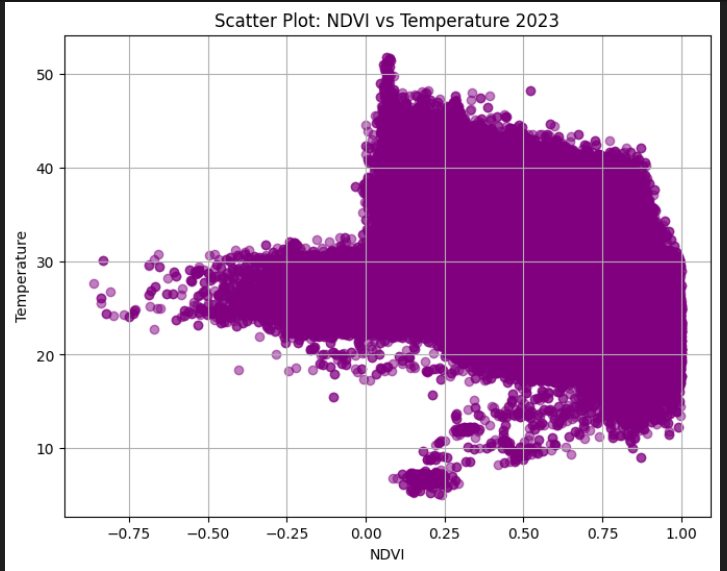
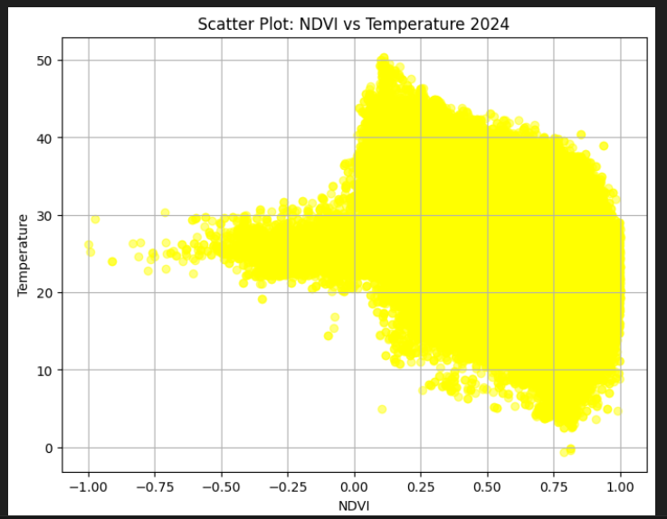

# EXAM
## Remote Sensing and GIS
## Group:
1. Miłosz Cygan - Leader - t1 
2. Weronika Budzisz - t4
3. Martyna Świercz - t3
4. Kacper Duda - t5
5. Kacper Prusak - t2

## Milosz Cygan RAPORT

#### Folder - Milosz_Cygan

* task1.ipynb - task1 in python
* task1.m - task1 in matlab
* task2.ipynb - task2 in python 

Python files ipynb contains imgages - plots

***

### Task 1 - everthing in folder 
### Task 2 - I used data sampling because my computer is too weak for such calculation

Metrics:
* ME: 3.99 m
* MAE: 4.30 m
* STD: 8.52 m
* RMSE: 9.41 m
***

## Weronika Budzisz RAPORT

#### Folder - Weronika_Budzisz

* task.ipynb - task1 in python
  
  
  
  
  
* task1.m - task1 in matlab

***

## Martyna Świercz RAPORT

#### Folder – Martyna_Swiercz

* task1.ipynb - task1 in python
* task1.m - task1 in matlab
* task2.ipynb - task2 in python 

***

### Task 1 - everthing in folder 
### Task 2 - I selected 4000 random points

Metrics:
* ME: 1.86 m
* MAE: 4.32 m
* STD: 7.58 m
* RMSE: 7.80 m

***

## Kacper Duda RAPORT

#### Folder – KDuda

* T1.ipynb - task1 in python
* T1.m - task1 in matlab
* T2.ipynb - task2 in python 

***

### Task 1 - everthing in folder 
### Task 2 - I selected 3000 random points

Metrics:
* MAE: 2.1805201389567057
* RMSE: 5.84502912652421
* Pearson correlation: 0.21430086

***

## KACPER PRUSAK RAPORT

#### Folder – kp_exam

* task1_kp.ipynb - task1 in python
* task1_kp.m - task1 in matlab
* task2_kp.ipynb - task2 in python 

***

### Task 1 - everthing in folder 
### Task 2 - I selected 6666 random points

Metrics:
* ME: 2.15 m
* MAE: 2.46 m
* STD: 4.19 m
* RMSE: 4.71 m

***

